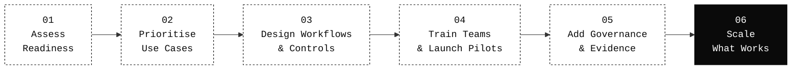

<!--
  VGTechConsulting · GitHub organisation profile
  Renders at https://github.com/VGTechConsulting
  Source: profile/README.md in the .github repo
-->

# VG Tech Consulting

**AI adoption, agents &amp; compliance for engineering teams.**

`+` &nbsp; Boutique AI Consultancy &nbsp; · &nbsp; Singapore &nbsp; · &nbsp; APAC &nbsp; · &nbsp; Est. 2025 &nbsp; `+`

 

&nbsp;

&nbsp;

 

> Get AI past the pilot stage: **shipped into production, governed, and measurably moving the business.**
>
> Founded by the former **Mercer AI Adoption &amp; Engineering Enablement** team for APAC. We led AI rollouts across engineering teams and software leadership across the region.

---

## `+` What we do

Three pieces that ship AI together — adoption, agents, compliance.

<table>
  <tr>
    <td valign="top" width="33%">
      <h3>01 &nbsp;·&nbsp; AI Adoption</h3>
      
<em>Train teams to use AI tools, copilots, and coding agents effectively.</em>

      
Structured rollout of AI tools and coding agents across engineering teams. Readiness assessments, hands-on enablement, tooling selection, and outcome measurement — for software companies moving AI from individual experimentation to operational practice.

      

        
          <code>Readiness assessment</code> · <code>Tooling selection</code> · <code>Hands-on enablement</code> · <code>Pilot design</code> · <code>Outcome measurement</code>
        
      

      
<a href="https://www.vgtc.io/services/ai-adoption"><b>Explore AI Adoption →</b></a>

    </td>
    <td valign="top" width="33%">
      <h3>02 &nbsp;·&nbsp; Agentic Systems</h3>
      
<em>Coding agents and AI employees that work inside your existing workflows.</em>

      
Design and deploy AI agent workflows, coding agents, and AI employees that sit inside real engineering and operational processes. Architecture, rollout, evaluation, and monitoring. Built for production, not demos.

      

        
          <code>Coding agents</code> · <code>AI employees</code> · <code>Evaluation harness</code> · <code>Architecture design</code> · <code>Monitoring</code>
        
      

      
<a href="https://www.vgtc.io/services/agentic-systems"><b>Explore Agentic Systems →</b></a>

    </td>
    <td valign="top" width="33%">
      <h3>03 &nbsp;·&nbsp; Compliance &amp; Governance</h3>
      
<em>Governance designed alongside the tooling, before the first audit.</em>

      
AI governance frameworks, SOC 2 readiness, data-handling controls, and audit-evidence design for engineering teams. Built to pass enterprise procurement and scale with the organisation.

      

        
          <code>Governance framework</code> · <code>SOC 2 readiness</code> · <code>MAS / PDPA / GDPR</code> · <code>Audit trails</code> · <code>Vendor risk</code>
        
      

      
<a href="https://www.vgtc.io/services/compliance-ai-operations"><b>Explore Compliance →</b></a>

    </td>
  </tr>
</table>

---

## `+` How we work

No slideware. Six concrete steps, each with something shipped at the end.

<a href="https://www.vgtc.io/how-we-work"><b>Read the full method →</b></a>

---

## `+` Proof at scale

<table>
  <tr>
    <td align="center" width="25%">
      <h3>5,000+</h3>
      Employees under governed LLM access — zero data incidents across 12-week rollout.
    </td>
    <td align="center" width="25%">
      <h3>10+</h3>
      Teams running governed coding agents, from 15-engineer scaleups to 5,000+ employee enterprises.
    </td>
    <td align="center" width="25%">
      <h3>~60%</h3>
      Faster PR review cycles after AI-assisted first-pass review (2.5 days → under 4 hours).
    </td>
    <td align="center" width="25%">
      <h3>0</h3>
      Audit findings on AI tooling — governance wired in from day one.
    </td>
  </tr>
</table>

---

## `+` Selected engagements

| Client | Profile | Engagement |
|---|---|---|
| **[HoverBot](https://hoverbot.ai)** | AI-native chatbot platform | Platform architecture &amp; agent workflows |
| **LabCaddy** | Scientific product platform | Conversational AI search |
| **B2B SaaS · Series B** | 15-person engineering org · APAC | Governed coding-agent rollout |
| **Global professional services** | 5,000+ employees · multi-jurisdiction | Private LLM platform &amp; knowledge retrieval |

---

## `+` Tools we work with

`OpenAI`  &nbsp;·&nbsp;  `Anthropic`  &nbsp;·&nbsp;  `Azure AI`  &nbsp;·&nbsp;  `AWS`  &nbsp;·&nbsp;  `Cursor`  &nbsp;·&nbsp;  `Claude Code`  &nbsp;·&nbsp;  `GitHub Copilot`  &nbsp;·&nbsp;  `Codex`  &nbsp;·&nbsp;  `Cline`  &nbsp;·&nbsp;  `LangChain`  &nbsp;·&nbsp;  `RAG Pipelines`  &nbsp;·&nbsp;  `Vercel`

Tool-agnostic. We pick based on your stack and constraints — no vendor affiliations, no preferred stack to push.

---

## `+` Why VG Tech Consulting

- **A model that survived real rollouts.** Adapted inside 5,000+ employee enterprises and 15-engineer scaleups alike.
- **Engineering-led delivery.** The work happens alongside your engineers, not above them.
- **Governance wired in from day one.** Enterprise security questionnaires don't trigger a scramble.
- **Tool-agnostic, client-stack first.** Existing tooling stays where it works; low learning curve for the team.
- **APAC fluency.** Deep familiarity with MAS, PDPA, regional market dynamics, and operational constraints.

---

## `+` Engage

<table>
  <tr>
    <td valign="top" width="50%">
      <h4>→ Book a 60-min diagnostic</h4>
      
Pressure-test your current AI approach. We return the two or three gaps most worth closing first — no slides, no salespeople.

      
<a href="https://cal.com/vg-tech"><code>cal.com/vg-tech</code></a>

    </td>
    <td valign="top" width="50%">
      <h4>→ Request a hands-on agentic SDLC demo</h4>
      
60–90 minutes in a real repo: branch protection through autonomous agents. No commitment, no slideware.

      
<a href="mailto:alex@vgtc.io?subject=Hands-on%20Agentic%20SDLC%20Demo"><code>alex@vgtc.io</code></a>

    </td>
  </tr>
</table>

 

`+` &nbsp; [vgtc.io](https://www.vgtc.io) &nbsp; · &nbsp; [Services](https://www.vgtc.io/services) &nbsp; · &nbsp; [How we work](https://www.vgtc.io/how-we-work) &nbsp; · &nbsp; [Insights](https://www.vgtc.io/insights) &nbsp; · &nbsp; [Trust](https://www.vgtc.io/trust) &nbsp; `+`

© VG Tech Consulting · Singapore · APAC

